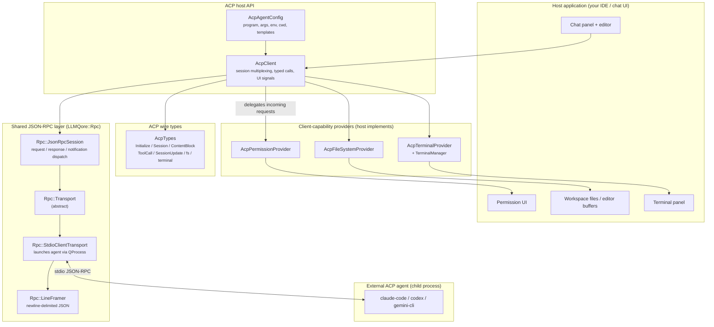

# ACP host architecture

LLMQore as an **ACP (Agent Client Protocol) client** — the *host* side, mirroring
Qt Creator 20's "ACP Client" extension. LLMQore launches an external coding agent
(Claude Code, Codex, Gemini CLI, …) as a child process over stdio, drives the
conversation, streams the agent's output into a chat UI, and **services the agent's
callbacks** into the workspace: permission prompts, file reads/writes, and terminal
commands.

> Direction matters. This stack makes LLMQore the **editor/host**, not the agent.
> The external process is the "brain" (it owns the model and the tool loop).
> LLMQore never talks to a provider `BaseClient` on this path — see the invariants
> below. The mirror image (LLMQore *being* an agent that an editor drives) is a
> separate, not-yet-built stack.

> **Status: implemented.** The shared JSON-RPC plumbing lives in a self-contained
> `LLMQore::Rpc` layer (`Rpc::Transport`, `Rpc::JsonRpcSession`,
> `Rpc::StdioClientTransport`, `Rpc::PipeTransport`, `Rpc::ErrorCode` + exceptions); ACP
> builds on it directly. The MCP stack keeps its historical `Mcp::*` spellings via
> compatibility aliases. The `Rpc::` names in the diagrams below are exact. See
> [`implementation-notes.md`](implementation-notes.md) for the alias table, file map and
> method coverage.

## Relationship to the existing stacks

LLMQore already ships two stacks (see [`../mcp/architecture.md`](../mcp/architecture.md)):

1. **LLM provider stack** — `BaseClient` + per-provider subclass, streaming, tool loop.
2. **MCP stack** — JSON-RPC over `McpTransport`/`McpSession`, client and server.

The ACP host is a **third stack** that *reuses the JSON-RPC plumbing of the MCP stack*
but is otherwise independent:

- **Transport + framing are shared.** ACP, like MCP-over-stdio, is newline-delimited
  JSON-RPC 2.0 over a child process's stdin/stdout. The existing
  `McpStdioClientTransport` + `McpLineFramer` already do exactly this.
- **The JSON-RPC dispatcher is shared.** `McpSession` is a generic request/response/
  notification engine; we extract its protocol-agnostic core as `Rpc::JsonRpcSession`
  (see [`architecture/transport-and-session.md`](architecture/transport-and-session.md)).
- **The provider stack is NOT involved.** Unlike the MCP client — which binds remote
  tools into `ToolsManager` so a `BaseClient` can call them — the ACP host has no
  `BaseClient`, no `ToolsManager`, no `BaseMessage`. The agent runs the model.

| Topic | Doc |
|---|---|
| Class diagram + ownership | [`architecture/classes.md`](architecture/classes.md) |
| Connection handshake + session lifecycle | [`architecture/connection-and-session.md`](architecture/connection-and-session.md) |
| Prompt turn: streaming + callbacks | [`architecture/prompt-turn.md`](architecture/prompt-turn.md) |
| Client capabilities (permission / fs / terminal) | [`architecture/client-capabilities.md`](architecture/client-capabilities.md) |
| Wire types + serialization idiom | [`architecture/types.md`](architecture/types.md) |
| Shared JSON-RPC session + transport | [`architecture/transport-and-session.md`](architecture/transport-and-session.md) |

---

## Layered architecture

## Invariants

- **The external agent is the brain.** The ACP host never instantiates a provider
  `BaseClient` and never runs a local tool loop. Compare the MCP client, which exists
  precisely to feed remote tools into a local `BaseClient`.
- **`Rpc::Transport` is the only byte-level boundary.** Everything above it works on
  `QJsonObject`. Identical to the MCP invariant — same abstraction, shared code.
- **`AcpClient` owns one transport / one agent process, multiplexes N sessions.**
  Every agent→host request and `session/update` carries a `sessionId`; `AcpClient`
  routes by it. Providers receive the `sessionId` on every call.
- **Client capabilities are pull, not push.** The host advertises `fs`/`terminal`
  support in `initialize`; if a provider is absent, the corresponding capability is
  reported `false` and the agent must not call it. An incoming call with no registered
  provider is answered with a JSON-RPC `MethodNotFound`/`InvalidRequest` error, never
  a crash.
- **Streaming is fire-and-forget notifications.** `session/update` is a JSON-RPC
  *notification* (no id, no response). The single outstanding `session/prompt`
  request is what resolves the turn, carrying the terminal `stopReason`.
- **Cancellation is per-session and best-effort.** `session/cancel` is a notification
  keyed by `sessionId`; the host then waits for the in-flight `session/prompt` to
  resolve with `stopReason: "Cancelled"`. There is no MCP-style request-id cancel or
  progress token on this path.
