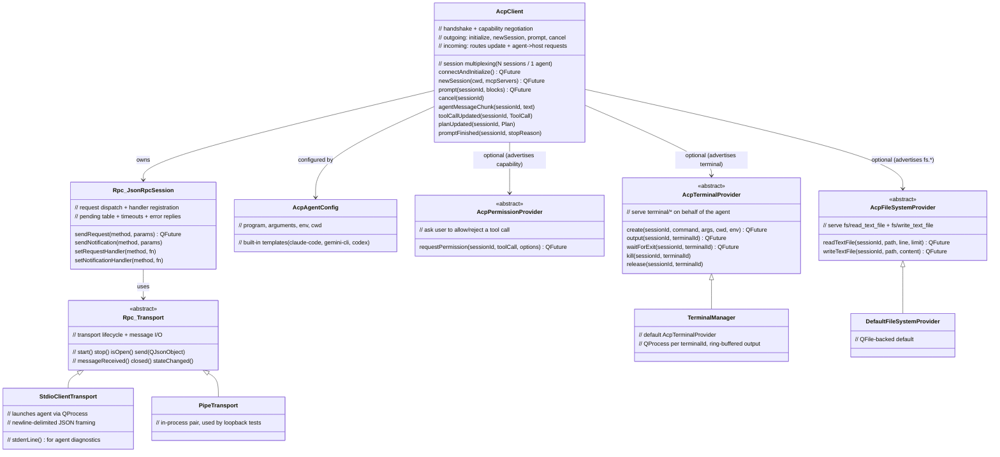

# ACP host class diagram

## Ownership rules

- **`Rpc::JsonRpcSession`** — owned by `AcpClient`. Never outlives its owner.
- **`Rpc::Transport`** — passed via constructor, NOT reparented. Caller owns lifetime
  (same rule as `McpTransport` today). For stdio, `AcpClient::shutdown()` stops the
  transport, which terminates the agent child process gracefully then `kill()`s.
- **Providers** (`AcpPermissionProvider`, `AcpFileSystemProvider`,
  `AcpTerminalProvider`) — held by `AcpClient` as `QPointer`. Caller owns; they must
  outlive the client. Absence of a provider ⇒ the matching capability is advertised
  `false` in `initialize`.
- **`TerminalManager`'s child processes** — owned by the manager, keyed by
  `terminalId`. Released on `terminal/release`, on session end, or on manager
  destruction (each `QProcess` is killed).
- **Session state** — `AcpClient` holds a `QHash<QString sessionId, SessionState>`.
  A `SessionState` tracks the outstanding `prompt` promise and the live tool calls so
  `tool_call_update` notifications can be merged into the right `ToolCall`.

## Why no `BaseClient` / `ToolsManager` here

In the MCP stack, `McpClient` exists to **bind remote tools into a local model loop**
(`McpToolBinder` → `ToolsManager` → `BaseClient`). The ACP host inverts that: the
remote process *is* the model loop. So none of `BaseClient`, `ToolsManager`,
`BaseMessage`, `McpRemoteTool`, or `McpToolBinder` appear on this path. The only
shared dependency is the JSON-RPC transport/session layer.
