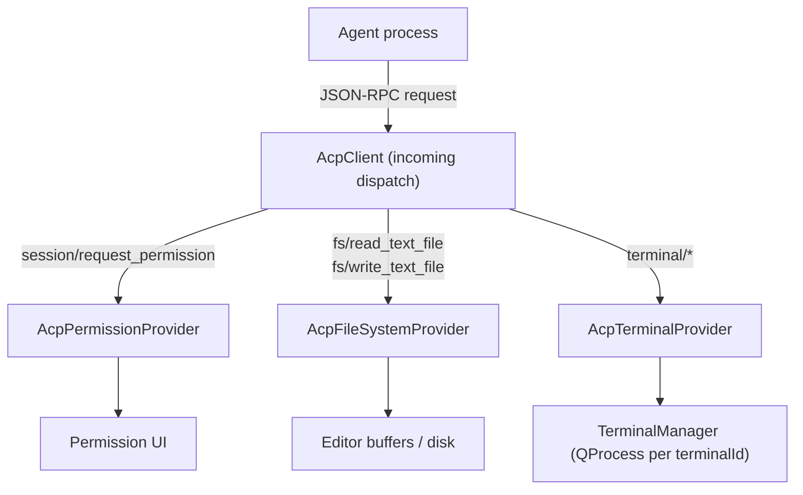
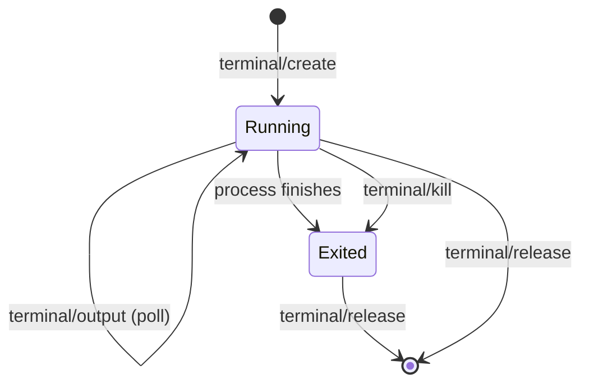

# Client capabilities (host-provided)

These are the services the **host** exposes *to the agent*. They are the inverse of
the outgoing calls in [`connection-and-session.md`](connection-and-session.md): here
the agent is the caller and `AcpClient` dispatches to a registered provider. Each
provider is optional; registering it flips the matching `clientCapabilities` flag in
`initialize`, which is the only thing that authorizes the agent to call it.

The provider interfaces mirror the existing MCP provider pattern
(`BaseRootsProvider`, `BaseElicitationProvider`): abstract `QObject` subclasses held
by `QPointer`, methods returning `QFuture` so a provider may answer asynchronously
(e.g. after user interaction).



## Permission — `session/request_permission`

```
QFuture<RequestPermissionResult> requestPermission(
    const QString &sessionId,
    const ToolCall &toolCall,
    const QList<PermissionOption> &options);
```

The agent asks before running a tool call it considers consequential (writing files,
running commands). `options` are agent-supplied choices, each with a `kind`:
`allow_once`, `allow_always`, `reject_once`, `reject_always`. The provider surfaces
them to the user and resolves with either `{ selected, optionId }` or `{ cancelled }`.

- A `*_always` choice is the host's cue to **remember** the decision and auto-answer
  future matching requests without prompting (policy lives in the host, not the agent).
- The default provider with no UI should resolve `cancelled` (safe default), not block.

## File system — `fs/read_text_file`, `fs/write_text_file`

```
QFuture<QString> readTextFile(sessionId, path, std::optional<int> line, std::optional<int> limit);
QFuture<void>    writeTextFile(sessionId, path, content);
```

Why route through the host instead of letting the agent touch disk directly:

- **Unsaved editor state.** In an IDE the freshest content is the open buffer, not the
  file on disk. `DefaultFileSystemProvider` is a plain `QFile` implementation; an IDE
  integration overrides it to read/write through editor buffers (this is exactly what
  Qt Creator's ACP Client does).
- **`line` / `limit`** let the agent fetch a slice of a large file (1-based line,
  capped line count) without streaming the whole thing.
- **Sandboxing.** The provider is the single chokepoint to confine paths to the
  session `cwd` + `additionalDirectories`.

## Terminal — `terminal/*`

The heaviest capability. `TerminalManager` (the default `AcpTerminalProvider`) owns a
`QProcess` per `terminalId`.

| Method | Behavior |
|---|---|
| `terminal/create` | spawn `command + args` in `cwd`/`env`, return `terminalId`; begin buffering output up to `outputByteLimit` (ring buffer, set `truncated`) |
| `terminal/output` | return current `output`, `truncated`, and `exitStatus` (null while running) |
| `terminal/wait_for_exit` | resolve when the process exits, with `exitCode`/`signal` |
| `terminal/kill` | terminate the process, keep the handle (output still readable) |
| `terminal/release` | drop the handle and free resources |



**MVP shortcut:** ship without terminal support. Register no `AcpTerminalProvider`,
advertise `terminal: false`, and the agent will avoid those calls. Add it once the
chat + edit loop works end to end.

## Invariants

- **Capability flag ⇔ provider presence.** Advertising a capability without a provider
  (or vice versa) is a bug. `AcpClient` derives the `initialize` flags from the
  registered providers so the two cannot drift.
- **No provider ⇒ explicit error.** An incoming request for an unadvertised capability
  is answered with a JSON-RPC error, never silently dropped.
- **Every provider future resolves.** Agent→host requests block the agent's turn;
  a provider that never resolves hangs the agent. Bound long operations with timeouts.
- **Terminal handles are session-scoped.** Ending a session releases all its
  terminals; `TerminalManager` kills any still-running child.
