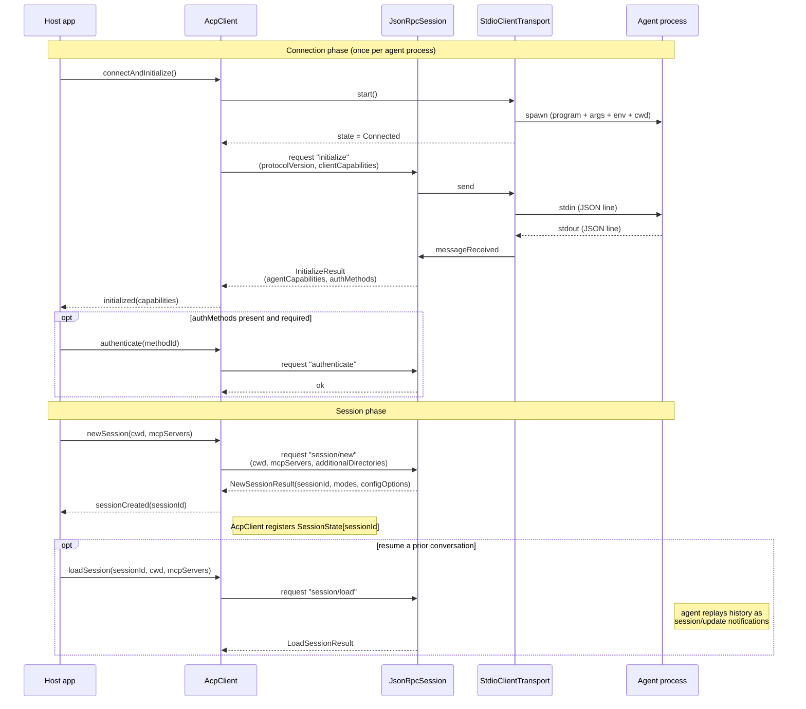

# Connection handshake + session lifecycle

Three phases, matching the ACP spec: **Connection** (`initialize`), optional
**Authentication** (`authenticate`), and **Session** (`session/new` or
`session/load`). The host drives all of them; the agent only responds.

## Capability negotiation

`initialize` is where the host declares what it can do for the agent. The declared
capabilities are derived from which providers are registered on `AcpClient`:

| `clientCapabilities` field | Set `true` when… |
|---|---|
| `fs.readTextFile` | an `AcpFileSystemProvider` is registered |
| `fs.writeTextFile` | the provider reports write support |
| `terminal` | an `AcpTerminalProvider` is registered |

The agent's reply (`agentCapabilities`) tells the host what *it* may use:

- `promptCapabilities.{image,audio,embeddedContext}` — which `ContentBlock` variants
  are safe to put in `session/prompt`.
- `loadSession` — whether `session/load` is allowed.
- `mcpCapabilities.{http,sse}` — which MCP server transports the agent accepts in
  `session/new` (see below).

## `mcpServers` pass-through — synergy with the MCP stack

`session/new` carries an `mcpServers` array: the host tells the agent which MCP
servers to connect to. LLMQore already models MCP server launch config (the
`mcpServers` schema used by `ToolsManager::loadMcpServers`). The ACP host **reuses
that config type verbatim**, serializing it into `session/new`. No new config schema.

So a single host can both (a) drive an external ACP agent and (b) hand that agent a
set of MCP servers to use — two LLMQore stacks meeting at one config object.

## Lifecycle invariants

- **`initialize` is sent exactly once** per agent process, before any session call.
  Calling `newSession` before `initialized()` is a programming error.
- **`protocolVersion` is an integer** on the wire (ACP uses `uint16`), unlike MCP's
  date-string versions. See [`types.md`](types.md).
- **Sessions are independent.** Each `sessionId` has its own history and its own
  outstanding-prompt slot. The same agent process serves all of them.
- **Shutdown order:** `AcpClient::shutdown()` → stop transport → transport closes the
  agent's stdin, waits, then kills. Any pending `prompt`/request promises are failed
  with a transport-closed error (same pattern as `McpSession::abortPending`).
