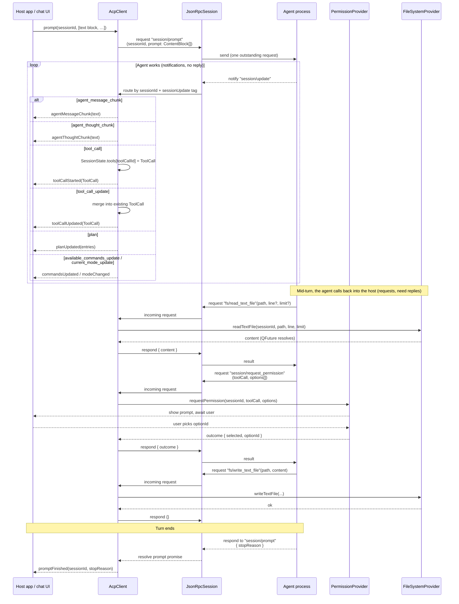
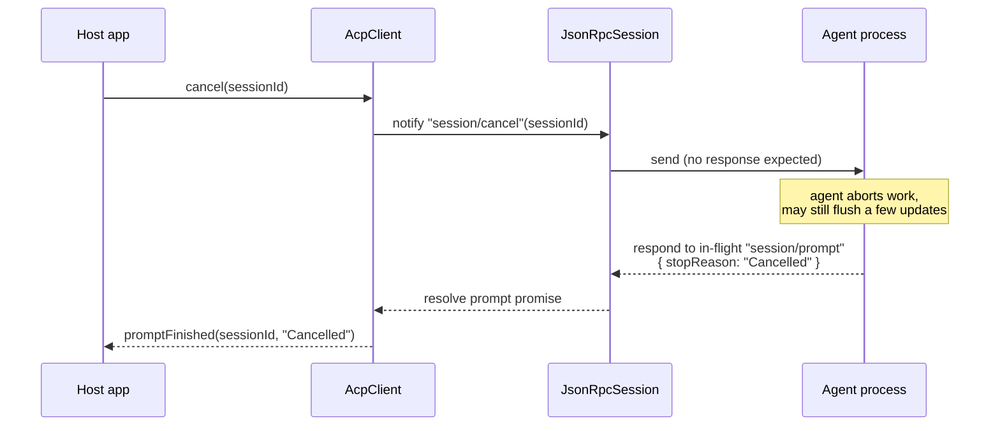

# Prompt turn: streaming + callbacks

The heart of the ACP host. One `session/prompt` request stays outstanding for the
whole turn. While it is pending, the agent (a) streams its thinking and answer back as
`session/update` **notifications**, and (b) makes **requests** back into the host
(permission, file system, terminal). The turn ends when the original `session/prompt`
request resolves with a `stopReason`.

## Cancellation

`cancel()` does **not** resolve the turn itself. It signals intent; the turn still
ends through the normal `session/prompt` resolution, now carrying
`stopReason: "Cancelled"`. The host must keep servicing updates/requests until then.

## `stopReason` values

| Value | Meaning |
|---|---|
| `end_turn` | Agent finished the turn normally. |
| `cancelled` | Turn ended because of a prior `session/cancel`. |
| `max_tokens` | Token budget for the turn was exhausted. |
| `max_turn_requests` | Per-turn model-request cap was hit. |
| `refusal` | Agent refused to continue. |

(Verified live: Claude Code returns `end_turn`. An earlier draft listed
`Completed`/`Error`, which the spec does not use.)

## ToolCall lifecycle on the host side

A `tool_call` update creates a `ToolCall` entry; subsequent `tool_call_update`s are
**merged** into it by `toolCallId` (status `Pending → Running → Completed | Failed`,
plus growing `content` and `locations`). The host UI renders one evolving card per
`toolCallId`, not one card per notification. `SessionState.tools` holds the
authoritative merged state, cleared when the turn ends.

## Invariants

- **Exactly one `session/prompt` is outstanding per session at a time.** A second
  `prompt()` on a busy session is rejected by `AcpClient` before hitting the wire.
- **`session/update` carries no reply.** Dropping or mis-routing one cannot deadlock
  the turn; only the `session/prompt` response can end it.
- **Agent→host requests block the agent until answered.** Provider futures must
  always resolve (success or error) — a hung provider hangs the agent's turn. Provide
  timeouts in long-running providers (notably terminal waits).
- **Permission outcome is mandatory.** If the user closes the prompt without choosing,
  the provider resolves with `outcome: { type: "cancelled" }`, never leaves it pending.
