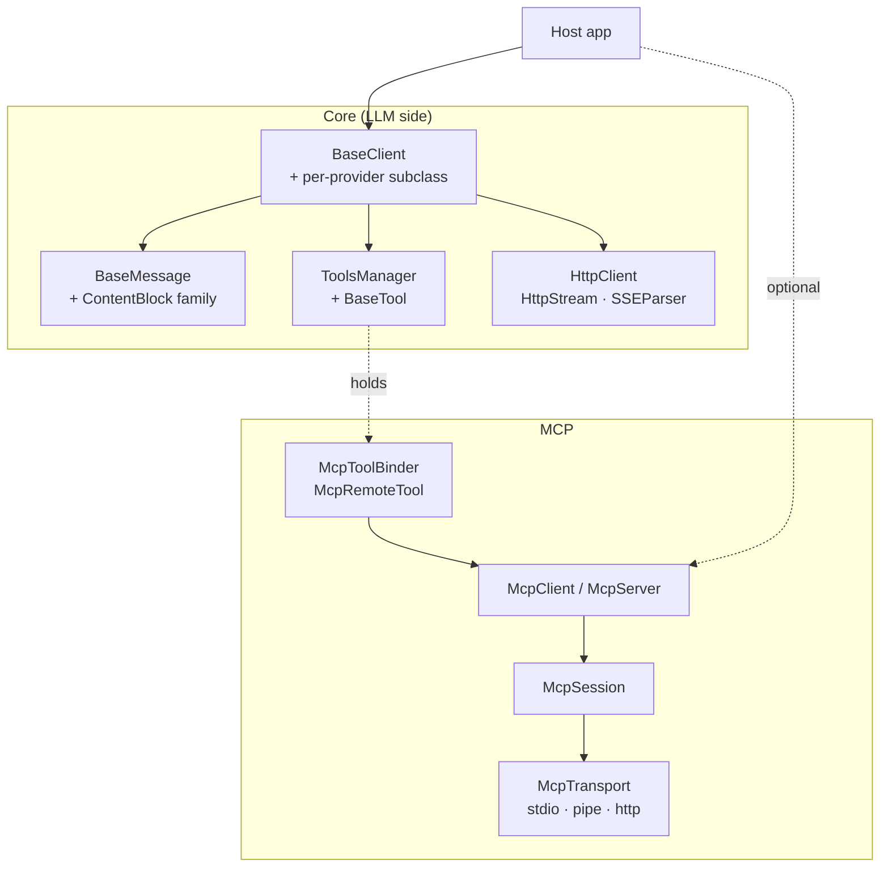

# LLMQore architecture

Two parallel stacks that meet in `ToolRegistry` / `ToolsManager`:

1. **LLM provider stack** — `BaseClient` subclass per provider
   (Claude, OpenAI, OpenAI Responses, Google Gemini, Ollama, llama.cpp),
   `BaseMessage` streaming parser, `HttpClient` + `SSEParser`, `ToolsManager`.
2. **MCP stack** — `McpTransport` + `McpSession` + `McpClient` /
   `McpServer`, provider abstractions, `McpToolBinder` glue that exposes
   remote MCP tools as local `BaseTool` instances.

An `McpRemoteTool` is a `BaseTool` subclass — any `BaseClient` can call
MCP tools without knowing they're remote.



---

## Index

### Core (LLM provider stack)

| Doc | When to read |
|---|---|
| [`architecture/overview.md`](architecture/overview.md) | Full layered view, invariants, source layout. |
| [`architecture/request-lifecycle.md`](architecture/request-lifecycle.md) | `sendMessage` → SSE → tool execution → `requestCompleted`/`requestFinalized`. |
| [`architecture/clients/base-client.md`](architecture/clients/base-client.md) | Adding a provider. Protected virtual contract, `ActiveRequest`, error handling. |
| [`architecture/clients/providers.md`](architecture/clients/providers.md) | Per-provider parser / payload shape cheatsheet. |
| [`architecture/messages-and-content.md`](architecture/messages-and-content.md) | `BaseMessage`, `MessageState`, `ContentBlock` hierarchy. |
| [`architecture/tools.md`](architecture/tools.md) | `BaseTool` / `ToolRegistry` / `ToolsManager` / `ToolResult`, execution queue, rich content in continuations. |
| [`architecture/networking.md`](architecture/networking.md) | `HttpClient`, `HttpStream`, `SSEParser`, `LineBuffer`, error taxonomy. |

### MCP stack

| Doc | When to read |
|---|---|
| [`mcp/architecture.md`](mcp/architecture.md) | MCP-stack overview and per-subsystem index. |
| [`mcp/architecture/classes.md`](mcp/architecture/classes.md) | MCP class diagram + ownership rules. |
| [`mcp/architecture/request-flow.md`](mcp/architecture/request-flow.md) | End-to-end sequence: prompt → remote MCP tool call. |
| [`mcp/architecture/async-patterns.md`](mcp/architecture/async-patterns.md) | `.then()` / `.onFailed()` idioms. |
| [`mcp/architecture/content-types.md`](mcp/architecture/content-types.md) | `ContentBlock` vs `ToolResult` in continuation payloads. |
| [`mcp/architecture/http-transport.md`](mcp/architecture/http-transport.md) | `McpHttpServerTransport` internals, piggyback buffer. |
| [`mcp/architecture/sampling.md`](mcp/architecture/sampling.md) | `setSamplingClient`, `requestFinalized` plumbing. |
| [`mcp/architecture/elicitation.md`](mcp/architecture/elicitation.md) | `elicitation/create` flow. |
| [`mcp/architecture/exceptions.md`](mcp/architecture/exceptions.md) | `McpException` hierarchy. |

### ACP host stack

LLMQore as an Agent Client Protocol *host* (like Qt Creator 20's "ACP Client"):
launches an external coding agent over stdio and drives it. Reuses the MCP stack's
JSON-RPC transport/session layer; does **not** use `BaseClient`. Implemented in
namespace `LLMQore::Acp` (`AcpClient`, `AcpTypes`, the provider interfaces, and
`AcpAgentConfig`).

| Doc | When to read |
|---|---|
| [`acp/implementation-notes.md`](acp/implementation-notes.md) | **As-built**: file map, method coverage, deviations from the design below. Start here. |
| [`acp/architecture.md`](acp/architecture.md) | ACP host overview, layered view, invariants, per-subsystem index. |
| [`acp/architecture/classes.md`](acp/architecture/classes.md) | ACP class diagram + ownership rules. |
| [`acp/architecture/connection-and-session.md`](acp/architecture/connection-and-session.md) | `initialize` handshake + `session/new` · `session/load` lifecycle. |
| [`acp/architecture/prompt-turn.md`](acp/architecture/prompt-turn.md) | `session/prompt` → streaming `session/update` → agent callbacks → `stopReason`. |
| [`acp/architecture/client-capabilities.md`](acp/architecture/client-capabilities.md) | Host-provided `session/request_permission`, `fs/*`, `terminal/*`. |
| [`acp/architecture/transport-and-session.md`](acp/architecture/transport-and-session.md) | Extracting shared `Rpc::JsonRpcSession` + transport from the MCP stack. |
| [`acp/architecture/types.md`](acp/architecture/types.md) | ACP wire types + `toJson`/`fromJson` idiom. |

---

## Directory layout

```
docs/
├── architecture.md               ← you are here
├── architecture/                 ← core (LLM-side) architecture notes
│   ├── overview.md
│   ├── request-lifecycle.md
│   ├── clients/
│   │   ├── base-client.md
│   │   └── providers.md
│   ├── messages-and-content.md
│   ├── tools.md
│   └── networking.md
├── quick-start.md                ← usage walk-through
├── integration.md                ← CMake integration
├── mcp/
│   ├── architecture.md           ← MCP-specific architecture entry
│   ├── architecture/             ← MCP-specific architecture notes
│   └── mcp_protocol_coverage.md
└── acp/                          ← ACP host stack
    ├── architecture.md           ← ACP host architecture entry
    ├── implementation-notes.md   ← as-built file map + method coverage
    └── architecture/             ← ACP-specific architecture notes
```

---

## Starting points by task

- **Add a new LLM provider** → [`architecture/clients/base-client.md`](architecture/clients/base-client.md), then [`providers.md`](architecture/clients/providers.md).
- **Add a tool that returns images** → [`architecture/tools.md`](architecture/tools.md).
- **Requests hanging / SSE issues** → [`architecture/networking.md`](architecture/networking.md) + [`architecture/request-lifecycle.md`](architecture/request-lifecycle.md).
- **Add a new content block type** → [`architecture/messages-and-content.md`](architecture/messages-and-content.md) + [`mcp/architecture/content-types.md`](mcp/architecture/content-types.md).
- **MCP internals** → [`mcp/architecture.md`](mcp/architecture.md).
- **Embed an external ACP agent (host side)** → [`acp/architecture.md`](acp/architecture.md).
