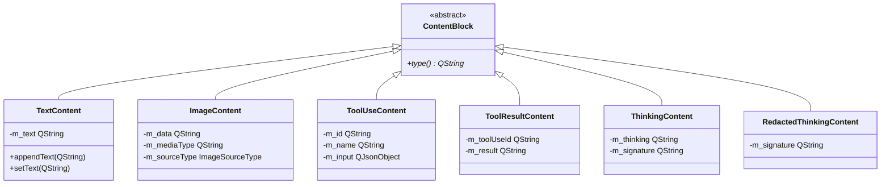

# Messages and content blocks

- **`BaseMessage`** -- accumulator for one streamed assistant turn. State machine: Building, RequiresToolExecution, Complete, Final. Holds an ordered list of `ContentBlock` objects.
- **`ContentBlock`** -- polymorphic model output: text, image, tool call, thinking, redacted thinking, tool result.

> `ContentBlock` = model **output**. `ToolContent` = tool **results**. Different directions. They meet in the continuation payload -- see [`tools.md`](tools.md) and [`../mcp/architecture/content-types.md`](../mcp/architecture/content-types.md).

---

## Message states

A `BaseMessage` moves through four states during its lifetime:

- **Building** -- the stream is still in progress and content blocks are being accumulated from incoming deltas.
- **RequiresToolExecution** -- the stream ended with one or more tool-use blocks. `BaseClient` will walk these blocks and dispatch them through `ToolsManager`.
- **Complete** -- the stream ended cleanly with no pending tool calls.
- **Final** -- terminal state after cleanup.

`BaseClient` inspects the state at two points: at end-of-stream (to decide whether to execute tools or complete normally) and during continuation (to read blocks before clearing the message for the next turn).

---

## BaseMessage

`BaseMessage` is the base class for per-provider streaming response parsers. It owns all `ContentBlock` instances (heap-allocated, deleted on destruction or when cleared for a continuation turn). Provider subclasses populate it by adding content blocks as SSE/JSON-lines events arrive.

The message exposes its current block list, and provides filtered accessors for tool-use blocks and thinking blocks. It also carries a raw stop-reason string that varies by provider -- each translator records it from the wire format with `recordStopReason(reason, map)`, which stores the string and resolves the state in one step. `stopReason()` is a plain accessor on the base, so no translator keeps a copy of its own. `BaseClient` captures the string before the message is cleaned up.

When a continuation turn begins, the message deletes all current blocks, empties its list, and resets to the Building state.

`startNewContinuation()` is **not** virtual, and that is the point. Every cache a translator keeps -- an index into the block list, a pending-arguments buffer, an item-id table -- points at blocks the base is about to delete, so it has to be dropped *first*. When the reset was an override, that ordering was a convention two of five translators got wrong, and the resulting bug (a thinking block reattached across a tool round) was caught in production, not review. The base now calls `clearDerivedCaches()` and only then deletes, and it clears the stop reason itself: a translator that forgets to override it loses nothing, and a translator that overrides it cannot run too late.

### Shared translator machinery

Four things every translator needed, so `BaseMessage` owns them:

- **`ToolCallAccumulator<Key>`** -- open a call, append argument fragments, close it. The key type is the provider's (`int` index for Claude and OpenAI Chat, `QString` call id for Responses); the tail -- parse the accumulated JSON and write it into the block -- is `completeToolCall`, which exists once. It deliberately leaves the block alone when nothing was accumulated: a buffered turn arrives with its arguments already complete, and overwriting them with an empty parse is exactly how the buffered path used to lose them.
- **`StopReasonMap`** -- the stop-reason automaton as provider data (`toolReasons`, `completeReasons`, `finalReasons`, `openReasons`, a fallback state, and a flag for providers whose terminal event carries no reason at all). `recordStopReason` is the one implementation. Same trick as `UsageSchema`.
- **`renderToolContent(block, naming)`** -- one renderer for MCP-shaped tool results. Only two things vary: the provider's word for a text block, and the image shape, which is a callback because the two shapes share no structure. A naming without an image callback renders an image as a text placeholder rather than throwing.
- **`ensureThinkingContentIndex()`** -- next to `ensureTextContentIndex()`, with the cached index living in the base so the reset above can clear it. `removeBlocksIf()` and `clearBlocks()` keep that index pointing at the same block (or forget it), so a translator never resets it by hand.

---

## Translator vocabulary

A translator is the per-provider `BaseMessage` subclass. Every one of them models the same lifecycle -- a block starts, deltas arrive, the block completes, and the turn ends -- so they spell it the same way. A reader who knows one translator can navigate the next without a second dictionary.

**Entry points.** `applyEvent(...)` takes one raw wire event, whole and unparsed beyond JSON, and returns `MessageEffects`. `applyResponse(body)` does the same for a whole non-streamed body. Both are the *only* public mutators, in all five translators: the dispatch ladder over the provider's event names lives inside the translator, once, and the client never re-derives it. A client that reads `event["type"]` for anything but a guard has taken dispatch back. The one stream with no translator is llama.cpp's native `/completion` shape, which carries plain text and no blocks; `LlamaCppClient` handles it directly.

**Phases.** `handleToolCallStart` / `handleToolCallDelta` / `handleToolCallComplete` for tool calls, `handleContentDelta` for assistant text, `handleStopReason` for the terminal event. Key types legitimately differ -- an `int` index for Claude and OpenAI Chat, a `QString` call id for Responses, an implicit current call for Google, a whole object for Ollama -- and so do arities; the phase word does not. There is deliberately no common base interface: nobody calls a translator polymorphically, and forcing one signature would buy a shim, not a seam.

**Wire words stay in string literals.** Google calls a tool call a `functionCall` and Ollama calls the terminal event `done`; those spellings live in the comparisons inside the translator, where they belong, not in the method names. The method names follow the library's own content vocabulary.

**Thinking is not aligned, on purpose.** Claude's `thinking`, OpenAI's `reasoning`, and Google's `thought` blocks carry genuinely different continuation tokens -- a signature, an encrypted item, a thought signature -- with different rules about when they may be dropped. Each translator keeps its provider's word so the difference stays visible at the call site.

**MessageEffects** is what a translator returns instead of reaching into the client: `chunk` (text for `chunkReceived`), `fullText` / `fallbackText` (a whole answer that replaces, or fills in for, what was streamed in the current round -- earlier rounds of the request are never touched), `usage` (an object for `applyUsage`), `error` (a provider error object; the request fails after any text of the same event is delivered), and the `thinkingCompleted` / `toolsReady` flags. `BaseClient::applyEffects` is the one place that turns them into calls, in one order, for every provider.

---

## ContentBlock hierarchy



| Block | Carries | Producer |
|---|---|---|
| `TextContent` | Assistant text output, appended as deltas arrive | Every provider |
| `ImageContent` | Base64/URL image + media type | Rare -- some providers echo images back |
| `ToolUseContent` | Tool id, name, accumulated input JSON | Tool-calling providers. Flips state to RequiresToolExecution |
| `ToolResultContent` | Tool-use id + flattened text result | Rarely seen on streamed input |
| `ThinkingContent` | Reasoning text + signature bytes | Claude, OpenAI Responses, OpenAI Chat (DeepSeek `reasoning_content`, Mistral Magistral) |
| `RedactedThinkingContent` | Opaque signature, no text | Claude (safety redaction) |

### Extending

```cpp
class CitationContent : public ContentBlock
{
public:
    explicit CitationContent(QString url, QString title)
        : m_url(std::move(url)), m_title(std::move(title)) {}
    QString type() const override { return "citation"; }
private:
    QString m_url, m_title;
};
```

Teach the provider's `BaseMessage` subclass to emit the new block, and teach consumers (continuation payload builder, UI) to handle it. No copy/move operators -- blocks are heap-allocated and reached via non-owning pointers.

---

## Blocks to continuation payload

When a response contains tool-use blocks, `BaseClient` walks them and dispatches each tool call through `ToolsManager`. Once all tools complete, the collected results are handed to the provider's continuation builder along with the original payload and the current message state. The provider reconstructs the assistant turn from the message's content blocks and builds a new user turn containing the tool results. Rich providers (Claude, Google, OpenAI Responses) preserve image blocks in the continuation; text-only providers (OpenAI Chat, Ollama) flatten rich content to text descriptions. The new payload is then re-posted, and the message is cleared for the next streaming turn.
