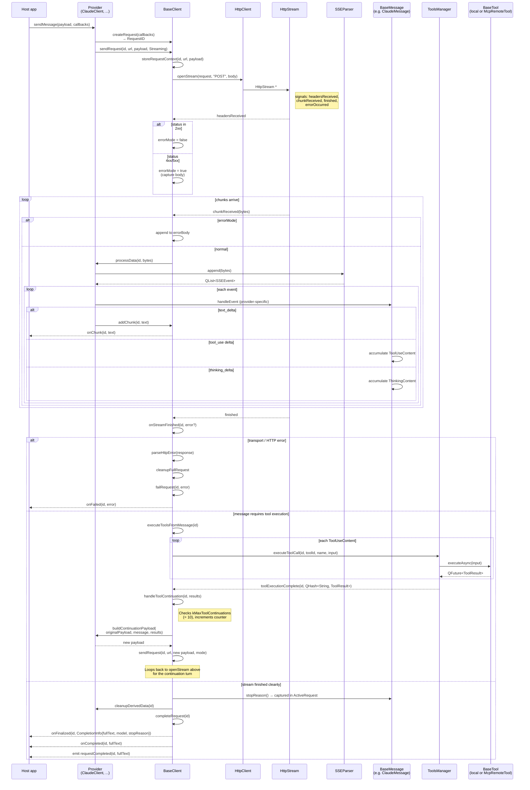

# Request lifecycle

---

## Phases

1. **Setup.** The provider subclass constructs its message object, registers it, and hands off to `BaseClient` which allocates a unique request ID, stores the caller's callbacks, and initiates the HTTP request.

2. **HTTP kickoff.** The base client chooses between a buffered one-shot request or a streaming connection depending on the requested mode. In streaming mode, the stream handle's signals are wired to internal handlers that look up the request context by ID.

3. **Header inspection.** A 2xx status means normal streaming proceeds. A 4xx or 5xx status switches the request into error mode, where incoming bytes are accumulated as an error body rather than being parsed as model output.

4. **Chunk loop.** In normal mode, each chunk of bytes is forwarded to the provider's stream parser, which pushes them through the appropriate framer (SSE or JSON-lines) to produce discrete events. Text deltas are forwarded to callbacks and signals immediately. Tool-use and thinking deltas accumulate silently inside the message object.

5. **Stream end.** Three outcomes are possible: an error (transport or HTTP) triggers failure notification and cleanup; pending tool-use blocks trigger the tool execution phase; otherwise the request completes normally with the stop reason captured from the message.

6. **Tool execution.** `ToolsManager` queues all pending tool calls, runs them asynchronously, and collects their results. Each tool produces a `ToolResult` (or an error result if it throws).

7. **Continuation.** After tool execution, the continuation counter is checked against the maximum (10). The provider builds a new payload incorporating the assistant's response and the tool results, and the request re-enters the HTTP phase under the same request ID.

8. **Final completion.** On clean completion, three notifications fire in order: a rich finalization callback (carrying full text, model name, and stop reason), a simple text completion callback, and the Qt completion signal.

9. **Cancellation.** Aborting a request tears down the stream, cleans up derived data, and delivers a failure notification. The destructor does the same for all pending requests.
