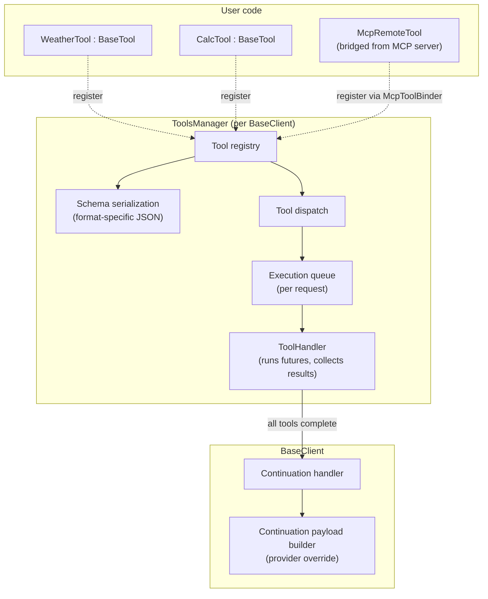

# Tools, execution, and results

- **`BaseTool`** -- abstract tool interface.
- **`ToolsManager`** -- per-client registry, schema builder, execution queue.
- **`ToolResult`** + **`ToolContent`** -- rich return envelope matching MCP `tools/call` wire format.



---

## BaseTool

`BaseTool` is the abstract interface for any tool the model can invoke. Each tool declares a stable identifier (used as the tool name on the wire), a human-readable display name, a description sent to the model, and a JSON Schema describing its parameters. The single async entry point returns a `QFuture<ToolResult>`, typically backed by `QtConcurrent::run` or a `QPromise`. The manager runs multiple tools concurrently.

Throwing from the async entry point is allowed -- exceptions are caught by the execution handler and converted to error results that the model can see and self-correct from.

Tools can be enabled or disabled at runtime. Disabled tools remain in the registry but are excluded from the schema definitions sent to providers. When a tool is registered with `ToolsManager`, it is reparented for ownership (exception: `McpServer` tool registration does not reparent).

---

## ToolsManager

One `ToolsManager` exists per `BaseClient`, lazily created on first access.

### Registry

Tools are stored in alphabetical order by ID. This ordering is deterministic and leaks to the wire (schema arrays, tool listings), which aids test reproducibility and cache stability. Tools can be added and removed at runtime; removal uses deferred deletion to stay safe for in-flight tools.

### Schema serialization

When building tool definitions for the provider, `ToolsManager` wraps each enabled tool into the format required by the provider's tool schema. The supported shapes differ -- some providers use a nested function wrapper, some use a flat structure, and Google groups declarations into an array. The format is determined by the provider's declared schema format.

### Execution queue

Each in-flight request has its own tool queue. When `BaseClient` detects pending tool calls in a response, it dispatches each one through `ToolsManager`, which appends them to the request's queue and runs them through `ToolHandler`. Tools execute asynchronously and their futures are monitored for completion. On success, the result is stored; on failure (thrown exception or future error), an error result is recorded so the model sees the failure. Once all tools in the queue complete, a batch-level completion signal delivers the full set of results to `BaseClient`, which proceeds to build the continuation payload.

Two levels of notification exist: a per-tool signal with flattened text (for UI display) and a per-batch signal with the full rich results (for continuation payload building, preserving images and resources).

---

## ToolResult and ToolContent

Mirrors the MCP `tools/call` result wire shape.

```cpp
struct ToolResult {
    QList<ToolContent> content;
    bool               isError = false;
    QJsonObject        structuredContent;  // MCP 2025-06-18+

    static ToolResult text(const QString &);
    static ToolResult error(const QString &);
    static ToolResult empty();

    QString   asText() const;
    QJsonObject toJson() const;
    static ToolResult fromJson(const QJsonObject &);
};
```

### ToolContent type variants

| Variant | Shape | Used for |
|---|---|---|
| `Text` | `{"type":"text","text":string}` | Common case |
| `Image` | `{"type":"image","data":base64,"mimeType":string}` | Charts, screenshots |
| `Audio` | `{"type":"audio","data":base64,"mimeType":string}` | Audio content |
| `Resource` | `{"type":"resource","resource":{uri,text?,blob?,mimeType?}}` | Embedded file body |
| `ResourceLink` | `{"type":"resource_link","uri":...,"name"?,...}` | Reference-only link |

### Text flattening

Text-only providers (OpenAI Chat, Ollama) need tool results as plain strings. The flattening method concatenates text blocks and replaces non-text content with bracketed descriptions (e.g., `[image: image/png]`, `[resource: file:///path]`).

### Error results

Tool failures produce results with an error flag set. The model sees the error and can self-correct. The same error path is used when a tool's async future throws an exception.

### Structured content

An optional JSON object can accompany the content list. Used by MCP servers for typed UI data. LLMCore preserves it end-to-end without imposing any schema.
