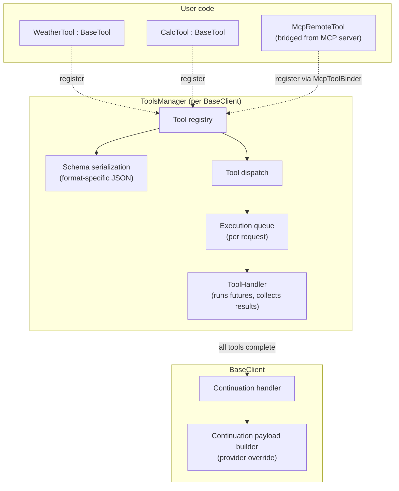

# Tools, execution, and results

- **`BaseTool`** -- abstract tool interface.
- **`ToolRegistry`** -- lightweight tool storage (add, remove, lookup, `toolsChanged` signal).
- **`ToolsManager`** -- extends `ToolRegistry` with per-client schema builder and execution queue.
- **`ToolResult`** + **`ToolContent`** -- rich return envelope matching MCP `tools/call` wire format.


```mermaid
flowchart TD
    subgraph User["User code"]
        T1["WeatherTool : BaseTool"]
        T2["CalcTool : BaseTool"]
        T3["McpRemoteTool<br/>(bridged from MCP server)"]
    end

    subgraph Manager["ToolsManager (per BaseClient)"]
        REG["Tool registry"]
        QUEUE["Execution queue<br/>(per request)"]
        SCHEMA["Schema serialization<br/>(format-specific JSON)"]
        EXEC["Tool dispatch"]
        HANDLER["ToolHandler<br/>(runs futures, collects results)"]
    end

    subgraph Client["BaseClient"]
        BC1["Continuation handler"]
        BC2["Continuation payload builder<br/>(provider override)"]
    end

    T1 -.register.-> REG
    T2 -.register.-> REG
    T3 -.register via McpToolBinder.-> REG
    REG --> SCHEMA
    REG --> EXEC
    EXEC --> QUEUE
    QUEUE --> HANDLER
    HANDLER -->|all tools complete| BC1
    BC1 --> BC2
```

---

## BaseTool

`BaseTool` is the abstract interface for any tool the model can invoke. Each tool declares a stable identifier (used as the tool name on the wire), a human-readable display name, a description sent to the model, and a JSON Schema describing its parameters. The single async entry point returns a `QFuture<ToolResult>`, typically backed by `QtConcurrent::run` or a `QPromise`. The manager runs multiple tools concurrently.

Throwing from the async entry point is allowed -- exceptions are caught by the execution handler and converted to error results that the model can see and self-correct from.

Tools can be enabled or disabled at runtime. Disabled tools remain in the registry but are excluded from the schema definitions sent to providers. When a tool is registered with `ToolRegistry` (or its subclass `ToolsManager`), it is reparented for ownership.

---

## ToolRegistry

`ToolRegistry` is the base class providing tool storage and lookup. Tools are stored in alphabetical order by ID. This ordering is deterministic and leaks to the wire (schema arrays, tool listings), which aids test reproducibility and cache stability. Tools can be added and removed at runtime; removal uses deferred deletion to stay safe for in-flight tools.

`McpServer` depends on `ToolRegistry` directly -- it only needs to enumerate and find tools, not build provider-specific schemas or execute tool queues.

## ToolsManager

`ToolsManager` extends `ToolRegistry` with provider-specific schema serialization and an execution queue. One `ToolsManager` exists per `BaseClient`, lazily created on first access.

### Schema serialization

When building tool definitions for the provider, `ToolsManager` wraps each enabled tool through a `ToolDialect` -- the object the client hands it at construction, obtained from `BaseClient::toolDialect()`. `wrapDefinition(tool)` produces one entry, and `finalizeDefinitions(array)` wraps the whole array for providers that need an envelope. The shapes differ -- some providers use a nested `function` wrapper, some a flat structure, and Google both sanitizes the parameter schema (dropping the JSON Schema keywords Gemini rejects) and groups declarations under a single `function_declarations` object -- but `ToolsManager` itself branches on nothing: each dialect lives next to its provider's message translator, alongside the code that reads tool results back.

### Who attaches the definitions

`BaseClient::ask(Conversation)` attaches them, not the application. It owns the `ToolsManager`, so it is the only place that can know both the registry and the dialect. The rule is one line: a non-empty registry puts the finished array under `tools`; an empty one omits the key entirely, because providers do not agree on what `"tools": []` means. Anything the caller passes in `extra` is merged afterwards and therefore wins, and the continuation payload inherits the key from the original request without re-deriving it.

`sendMessage(QJsonObject)` remains the hand-built path, and it stays literal: nothing is attached to a payload the host wrote itself. That is what `ToolsManager::getToolsDefinitions()` is public for.

Only enabled tools count, so a request that must go out without any -- a local model that rejects the `tools` key -- is one where every tool is disabled with `BaseTool::setEnabled(false)`, or one built by hand and sent through `sendMessage`.

### Execution queue

Each in-flight request has its own tool queue. When `BaseClient` detects pending tool calls in a response, it dispatches each one through `ToolsManager`, which appends them to the request's queue and runs them through `ToolHandler`. Tools execute asynchronously and their futures are monitored for completion. On success, the result is stored; on failure (thrown exception or future error), an error result is recorded so the model sees the failure. Once all tools in the round complete, the round's ledger is closed and cleared, and a batch-level completion signal delivers that round's results to the client, which enforces the round limit, builds the continuation payload, and resends. Clearing at the boundary is what lets a model reuse a tool-call id in the next round without the call being deduplicated away.

Two levels of notification exist: a per-tool signal with flattened text (for UI display) and a per-batch signal with the full rich results (for continuation payload building, preserving images and resources).

---

## ToolResult and ToolContent

Mirrors the MCP `tools/call` result wire shape.

```cpp
struct ToolResult {
    QList<ToolContent> content;
    bool               isError = false;
    QJsonObject        structuredContent;  // MCP 2025-06-18+

    static ToolResult text(const QString &);
    static ToolResult error(const QString &);
    static ToolResult empty();

    QString   asText() const;
    QJsonObject toJson() const;
    static ToolResult fromJson(const QJsonObject &);
};
```

### ToolContent type variants

| Variant | Shape | Used for |
|---|---|---|
| `Text` | `{"type":"text","text":string}` | Common case |
| `Image` | `{"type":"image","data":base64,"mimeType":string}` | Charts, screenshots |
| `Audio` | `{"type":"audio","data":base64,"mimeType":string}` | Audio content |
| `Resource` | `{"type":"resource","resource":{uri,text?,blob?,mimeType?}}` | Embedded file body |
| `ResourceLink` | `{"type":"resource_link","uri":...,"name"?,...}` | Reference-only link |

### Text flattening

Text-only providers (OpenAI Chat, Ollama) need tool results as plain strings. The flattening method concatenates text blocks and replaces non-text content with bracketed descriptions (e.g., `[image: image/png]`, `[resource: file:///path]`).

### Error results

Tool failures produce results with an error flag set. The model sees the error and can self-correct. The same error path is used when a tool's async future throws an exception.

### Structured content

An optional JSON object can accompany the content list. Used by MCP servers for typed UI data. LLMQore preserves it end-to-end without imposing any schema.
