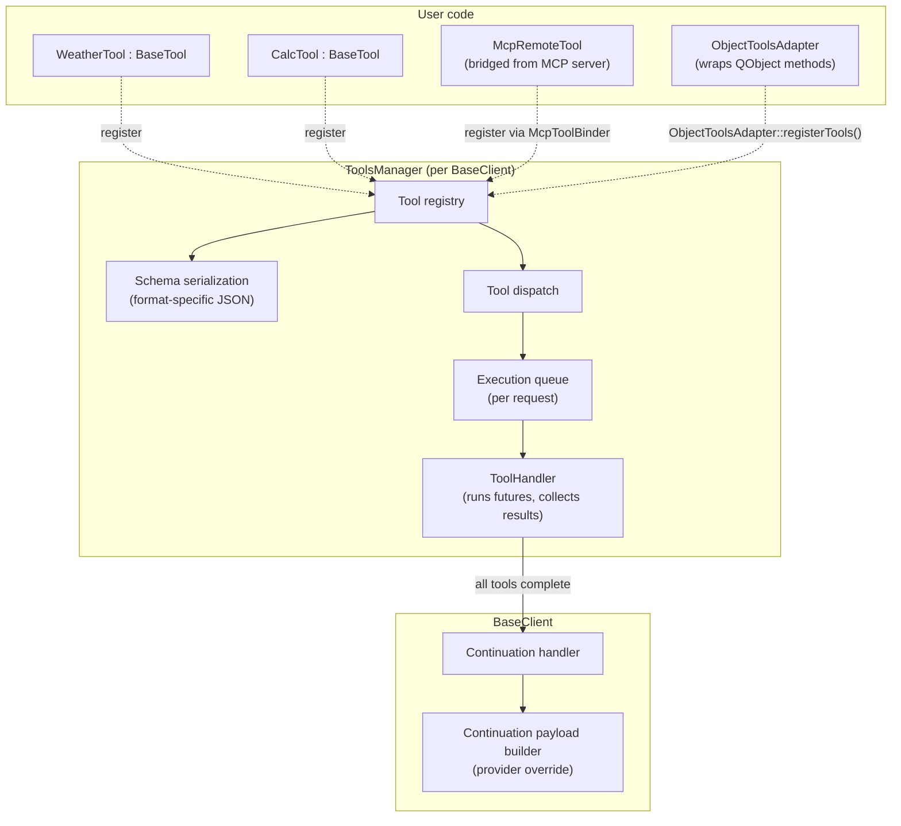

# Tools, execution, and results

- **`BaseTool`** -- abstract tool interface.
- **`ToolRegistry`** -- lightweight tool storage (add, remove, lookup, `toolsChanged` signal).
- **`ToolsManager`** -- extends `ToolRegistry` with per-client schema builder and execution queue.
- **`ToolResult`** + **`ToolContent`** -- rich return envelope matching MCP `tools/call` wire format.


```mermaid
flowchart TD
    subgraph User["User code"]
        T1["WeatherTool : BaseTool"]
        T2["CalcTool : BaseTool"]
        T3["McpRemoteTool<br/>(bridged from MCP server)"]
        T4["ObjectToolsAdapter<br/>(wraps QObject methods)"]
    end

    subgraph Manager["ToolsManager (per BaseClient)"]
        REG["Tool registry"]
        QUEUE["Execution queue<br/>(per request)"]
        SCHEMA["Schema serialization<br/>(format-specific JSON)"]
        EXEC["Tool dispatch"]
        HANDLER["ToolHandler<br/>(runs futures, collects results)"]
    end

    subgraph Client["BaseClient"]
        BC1["Continuation handler"]
        BC2["Continuation payload builder<br/>(provider override)"]
    end

    T1 -.register.-> REG
    T2 -.register.-> REG
    T3 -.register via McpToolBinder.-> REG
    T4 -.ObjectToolsAdapter::registerTools().-> REG
    REG --> SCHEMA
    REG --> EXEC
    EXEC --> QUEUE
    QUEUE --> HANDLER
    HANDLER -->|all tools complete| BC1
    BC1 --> BC2
```

---

## BaseTool

`BaseTool` is the abstract interface for any tool the model can invoke. Each tool declares a stable identifier (used as the tool name on the wire), a human-readable display name, a description sent to the model, and a JSON Schema describing its parameters. The single async entry point returns a `QFuture<ToolResult>`, typically backed by `QtConcurrent::run` or a `QPromise`. The manager runs multiple tools concurrently.

Throwing from the async entry point is allowed -- exceptions are caught by the execution handler and converted to error results that the model can see and self-correct from.

Tools can be enabled or disabled at runtime. Disabled tools remain in the registry but are excluded from the schema definitions sent to providers. When a tool is registered with `ToolRegistry` (or its subclass `ToolsManager`), it is reparented for ownership.

---

## ToolRegistry

`ToolRegistry` is the base class providing tool storage and lookup. Tools are stored in alphabetical order by ID. This ordering is deterministic and leaks to the wire (schema arrays, tool listings), which aids test reproducibility and cache stability. Tools can be added and removed at runtime; removal uses deferred deletion to stay safe for in-flight tools.

`McpServer` depends on `ToolRegistry` directly -- it only needs to enumerate and find tools, not build provider-specific schemas or execute tool queues.

## ToolsManager

`ToolsManager` extends `ToolRegistry` with provider-specific schema serialization and an execution queue. One `ToolsManager` exists per `BaseClient`, lazily created on first access.

### Schema serialization

When building tool definitions for the provider, `ToolsManager` wraps each enabled tool through a `ToolDialect` -- the object the client hands it at construction, obtained from `BaseClient::toolDialect()`. `wrapDefinition(tool)` produces one entry, and `finalizeDefinitions(array)` wraps the whole array for providers that need an envelope. The shapes differ -- some providers use a nested `function` wrapper, some a flat structure, and Google both sanitizes the parameter schema (dropping the JSON Schema keywords Gemini rejects) and groups declarations under a single `function_declarations` object -- but `ToolsManager` itself branches on nothing: each dialect lives next to its provider's message translator, alongside the code that reads tool results back.

### Execution queue

Each in-flight request has its own tool queue. When `BaseClient` detects pending tool calls in a response, it dispatches each one through `ToolsManager`, which appends them to the request's queue and runs them through `ToolHandler`. Tools execute asynchronously and their futures are monitored for completion. On success, the result is stored; on failure (thrown exception or future error), an error result is recorded so the model sees the failure. Once all tools in the round complete, the round's ledger is closed and cleared, and a batch-level completion signal delivers that round's results to the client, which enforces the round limit, builds the continuation payload, and resends. Clearing at the boundary is what lets a model reuse a tool-call id in the next round without the call being deduplicated away.

Two levels of notification exist: a per-tool signal with flattened text (for UI display) and a per-batch signal with the full rich results (for continuation payload building, preserving images and resources).

---

## ToolResult and ToolContent

Mirrors the MCP `tools/call` result wire shape.

```cpp
struct ToolResult {
    QList<ToolContent> content;
    bool               isError = false;
    QJsonObject        structuredContent;  // MCP 2025-06-18+

    static ToolResult text(const QString &);
    static ToolResult error(const QString &);
    static ToolResult empty();

    QString   asText() const;
    QJsonObject toJson() const;
    static ToolResult fromJson(const QJsonObject &);
};
```

### ToolContent type variants

| Variant | Shape | Used for |
|---|---|---|
| `Text` | `{"type":"text","text":string}` | Common case |
| `Image` | `{"type":"image","data":base64,"mimeType":string}` | Charts, screenshots |
| `Audio` | `{"type":"audio","data":base64,"mimeType":string}` | Audio content |
| `Resource` | `{"type":"resource","resource":{uri,text?,blob?,mimeType?}}` | Embedded file body |
| `ResourceLink` | `{"type":"resource_link","uri":...,"name"?,...}` | Reference-only link |

### Text flattening

Text-only providers (OpenAI Chat, Ollama) need tool results as plain strings. The flattening method concatenates text blocks and replaces non-text content with bracketed descriptions (e.g., `[image: image/png]`, `[resource: file:///path]`).

### Error results

Tool failures produce results with an error flag set. The model sees the error and can self-correct. The same error path is used when a tool's async future throws an exception.

### Structured content

An optional JSON object can accompany the content list. Used by MCP servers for typed UI data. LLMQore preserves it end-to-end without imposing any schema.

---

## ObjectToolsAdapter

`ObjectToolsAdapter` bridges existing QObjects to the tool system, automatically wrapping public methods as tools without requiring manual `BaseTool` subclasses. Each method becomes a tool with parameters inferred from the method signature and metadata from `Q_CLASSINFO`.

**Security note:** Only direct subclasses of `AbstractToolObject` are permitted. This restriction prevents unintended exposure of methods from arbitrary `QObject` subclasses.

### Usage

```cpp
// Create an adapter from an AbstractToolObject subclass
auto *adapter = ObjectToolsAdapter::create<MyObject>();

// Register all public methods as tools
ToolRegistry registry;
auto tools = adapter->registerTools(&registry);

// Or filter by method type (e.g., only public slots)
auto filteredTools = adapter->registerTools(&registry, 
                                            ObjectToolsAdapter::PublicSlot);
```

The prefix for method filtering is defined by overriding `toolPrefix()` on the `AbstractToolObject` subclass (see below).

### Base class requirement

Objects must directly inherit from `AbstractToolObject` (not just any `QObject`):

```cpp
class MyObject : public LLMQore::AbstractToolObject {
    Q_OBJECT
    
public:
    Q_INVOKABLE QString myMethod(const QString &input) { return input; }
};
```

`ObjectToolsAdapter::create<T>()` will return `nullptr` if `T` does not directly inherit from `AbstractToolObject`.

**Object naming:**

The `name()` method returns the object's name (for use in tool descriptions and error messages):
- If `QObject::objectName()` is set, it is returned
- Otherwise, the class name is used
- The result is cached after the first call

```cpp
auto *obj = ObjectToolsAdapter::create<MyObject>();
qDebug() << obj->object()->name();  // "MyObject" (class name) or custom name if set
```

### Method discovery and filtering

Methods are discovered via Qt's meta-object system. The filter parameter controls which methods are candidates:

- **`PublicInvokable`** -- `Q_INVOKABLE` methods with public access
- **`PublicSlot`** -- public slots
- **`AllPublic`** -- both (default)

**Method prefix filtering:**

Override `toolPrefix()` to specify a prefix for method filtering:

```cpp
class MyObject : public LLMQore::AbstractToolObject {
    Q_OBJECT

protected:
    QString toolPrefix() const override { return "tool_"; }
};
```

If a non-empty prefix is returned, only methods starting with that prefix will be considered for registration. The prefix is automatically stripped from the resulting tool ID (e.g., `tool_myMethod` becomes `myMethod`).

### Parameter schema inference

Method parameters are mapped to JSON Schema types:

| C++ Type | Schema Type |
|---|---|
| `int` | `integer` |
| `double` | `number` |
| `QString` | `string` |
| `bool` | `boolean` |
| `QJsonObject` | `object` |
| `QJsonArray`, `QStringList` | `array` |

All parameters are required (default parameters are not supported by `QMetaMethod::invoke`).

### Display name and description via Q_CLASSINFO

Both `displayName` and `description` must be provided for a method to be registered as a tool. If either is missing, the method is skipped.

By default:
- The tool ID is the method name (minus prefix)
- The `displayName` defaults to the method name if a custom one is not provided via `Q_CLASSINFO`
- The `description` has **no default** -- it must be explicitly provided

Provide metadata via `Q_CLASSINFO`:

```cpp
class MyObject : public LLMQore::AbstractToolObject {
    Q_OBJECT
    
    Q_CLASSINFO("myTool.displayName", "My Custom Tool")
    Q_CLASSINFO("myTool.description", "Does something useful")
    Q_INVOKABLE QString myTool(const QString &input) { return input; }
};
```

**Custom metadata via `queryMethodInfo()`:**

In most cases, the default `queryMethodInfo()` implementation is sufficient when using `Q_CLASSINFO` for metadata. Override only when you need custom filtering logic (e.g., allowing only specific methods by name, complex metadata discovery, or conditional tool registration).

Overrides must independently construct `id`, `displayName`, and `description`, and should filter which methods become tools. Access `toolPrefix()` and `name()` from the object itself:

```cpp
class MyObject : public LLMQore::AbstractToolObject {
    Q_OBJECT
    
public:
    Q_INVOKABLE QString myTool(const QString &input) { return input; }
    Q_INVOKABLE QString anotherTool() { return "result"; }
    Q_INVOKABLE QString internalMethod() { return "internal"; }

protected:
    bool queryMethodInfo(const QMetaMethod &method, QString &id, QString &displayName,
                         QString &description) override
    {
        // Validate method: must be public method or slot
        if ((method.methodType() != QMetaMethod::Method && method.methodType() != QMetaMethod::Slot)
            || method.access() != QMetaMethod::Public)
            return false;
        
        // Filter: only allow specific methods by name
        QString methodName = QString::fromLatin1(method.name());
        static const QStringList allowedMethods = { "myTool", "anotherTool" };
        if (!allowedMethods.contains(methodName))
            return false;
        
        // Build id from method name, stripping prefix if present
        id = methodName;
        const QString prefix = this->toolPrefix();
        if (!prefix.isEmpty() && id.startsWith(prefix)) {
            id.remove(0, prefix.length());
        }
        
        // Set displayName (may come from Q_CLASSINFO or custom logic)
        displayName = id;  // Default: use id as displayName
        
        // Set description (must be explicit; no default)
        description = QString("Calls %1 on %2").arg(id, this->name());
        
        return !id.isEmpty() && !displayName.isEmpty() && !description.isEmpty();
    }
};
```

Return `true` only if the method should be wrapped as a tool and all three (`id`, `displayName`, `description`) are non-empty; return `false` to skip the method.

### Return value handling

Methods can return:

- **`void`** -- converted to `"The tool was called successfully."`
- **`QString`** -- converted to text content
- **`QJsonObject`** -- parsed as rich content if it has a recognized `"type"` field (text, image, audio, resource, resource_link); otherwise stored as structured JSON
- **Convertible to string** -- stringified

### Thread affinity

`ObjectToolsAdapter::create()` enforces a key constraint: **it must be called from the main thread**. Internally, the adapter moves the wrapped object to a dedicated worker thread for thread-safe execution; method invocations use `Qt::BlockingQueuedConnection` to marshal calls across threads. This design ensures that:

- The adapter and registry can be used from any thread safely
- The wrapped object's slot code runs in a predictable thread context
- No locking is needed in the tool methods themselves

If called from a non-main thread, `create()` returns `nullptr`.

### Lifecycle

The adapter and its wrapped object are bound: deleting either triggers deletion of the other via queued connections. The object is moved to the worker thread for safe method invocation across thread boundaries.
