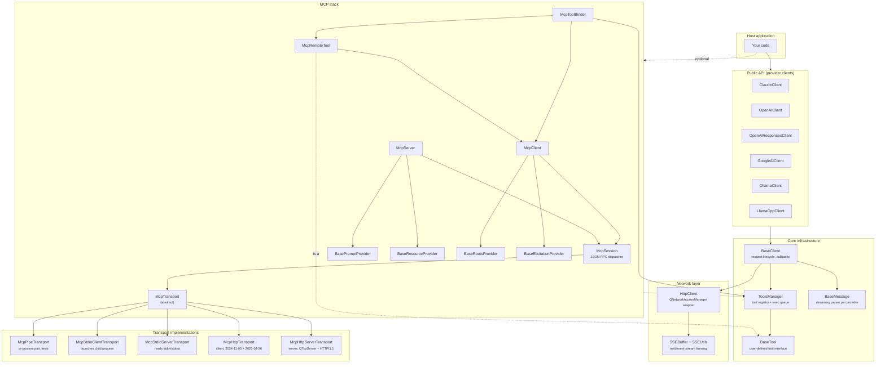

# MCP architecture

Two parallel stacks meeting in `ToolsManager`:

1. **LLM provider stack** — `BaseClient` + per-provider subclass, `BaseMessage` parser, `HttpClient`/SSE, `ToolsManager`.
2. **MCP stack** — `McpTransport` + `McpSession` + `McpClient`/`McpServer`, provider abstractions (`BasePromptProvider`, `BaseResourceProvider`, `BaseRootsProvider`, `BaseElicitationProvider`), bridge classes (`McpRemoteTool`, `McpToolBinder`). Sampling uses `BaseClient` directly via `setSamplingClient()` — no separate provider abstraction.

Stacks are independent: use as LLM client without MCP, or run `McpServer` without `BaseClient`. `McpToolBinder` is the glue registering remote tools into `ToolsManager`.

| Topic | Doc |
|---|---|
| Class diagram + ownership | [`architecture/classes.md`](architecture/classes.md) |
| End-to-end request flow | [`architecture/request-flow.md`](architecture/request-flow.md) |
| Async chain model | [`architecture/async-patterns.md`](architecture/async-patterns.md) |
| Content type hierarchies | [`architecture/content-types.md`](architecture/content-types.md) |
| HTTP hosting internals | [`architecture/http-transport.md`](architecture/http-transport.md) |
| Sampling (`createMessage`) | [`architecture/sampling.md`](architecture/sampling.md) |
| Elicitation (`elicitation/create`) | [`architecture/elicitation.md`](architecture/elicitation.md) |
| Exception hierarchy | [`architecture/exceptions.md`](architecture/exceptions.md) |

---

## Layered architecture

## Invariants

- **Provider clients never talk to `McpSession` directly.** MCP tools are `McpRemoteTool` instances in `ToolsManager`.
- **`McpTransport` is the only byte-level boundary.** Rest works on `QJsonObject`.
- **`BaseClient` owns HTTP side; `McpSession` owns JSON-RPC side.** No shared code/types.
- **One `ToolsManager` holds tools from multiple sources** — indistinguishable to `buildContinuationPayload`.
