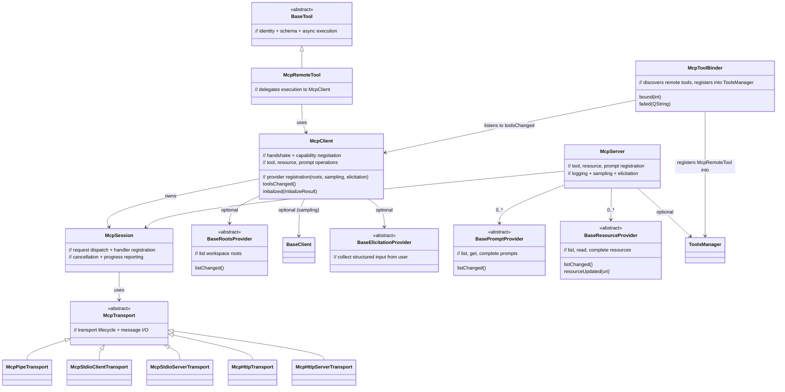

# MCP class diagram

## Ownership rules

- **`McpSession`** — owned by `McpClient` or `McpServer`. Never outlives owner.
- **`McpTransport`** — passed via constructor, NOT reparented. Caller owns lifetime.
- **`McpRemoteTool`** — parented to `ToolsManager` (via `addTool`). Dies with manager or on `McpToolBinder` refresh.
- **Providers** (`BasePromptProvider`, `BaseResourceProvider`, `BaseRootsProvider`, `BaseElicitationProvider`) and sampling `BaseClient` — held as `QPointer`. Caller owns, must outlive server/client.
- **`BaseTool` via `McpServer::addTool()`** — NOT reparented (unlike `ToolsManager::addTool`).
