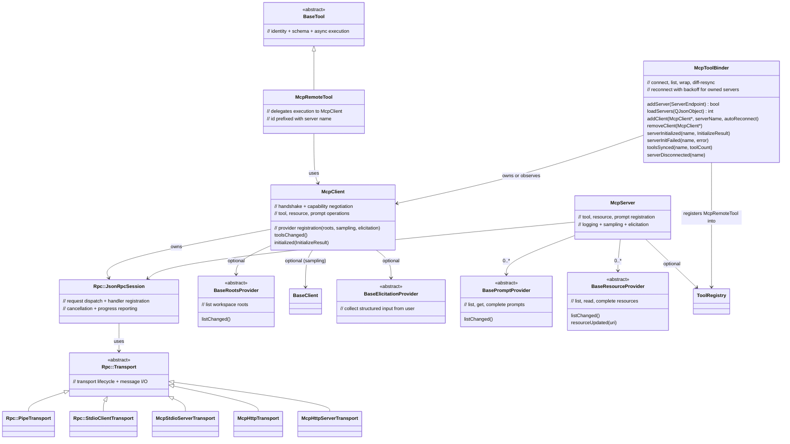

# MCP class diagram

```mermaid
classDiagram
    class RpcTransport["Rpc::Transport"] {
        <<abstract>>
        // transport lifecycle + message I/O
    }

    class RpcPipeTransport["Rpc::PipeTransport"]
    class RpcStdioClientTransport["Rpc::StdioClientTransport"]
    class McpStdioServerTransport
    class McpHttpTransport
    class McpHttpServerTransport

    RpcTransport <|-- RpcPipeTransport
    RpcTransport <|-- RpcStdioClientTransport
    RpcTransport <|-- McpStdioServerTransport
    RpcTransport <|-- McpHttpTransport
    RpcTransport <|-- McpHttpServerTransport

    class JsonRpcSession["Rpc::JsonRpcSession"] {
        // request dispatch + handler registration
        // cancellation + progress reporting
    }

    JsonRpcSession --> RpcTransport : uses

    class McpClient {
        // handshake + capability negotiation
        // tool, resource, prompt operations
        // provider registration (roots, sampling, elicitation)
        toolsChanged()
        initialized(InitializeResult)
    }

    class McpServer {
        // tool, resource, prompt registration
        // logging + sampling + elicitation
    }

    McpClient --> JsonRpcSession : owns
    McpServer --> JsonRpcSession : owns
    McpClient --> BaseRootsProvider : optional
    McpClient --> BaseClient : optional (sampling)
    McpClient --> BaseElicitationProvider : optional
    McpServer --> BasePromptProvider : 0..*
    McpServer --> BaseResourceProvider : 0..*
    McpServer --> ToolRegistry : optional

    class BaseTool {
        <<abstract>>
        // identity + schema + async execution
    }

    class McpRemoteTool {
        // delegates execution to McpClient
        // id prefixed with server name
    }

    BaseTool <|-- McpRemoteTool
    McpRemoteTool --> McpClient : uses

    class McpToolBinder {
        // connect, list, wrap, diff-resync
        // reconnect with backoff for owned servers
        addServer(ServerEndpoint) bool
        loadServers(QJsonObject) int
        addClient(McpClient*, serverName, autoReconnect)
        removeClient(McpClient*)
        serverInitialized(name, InitializeResult)
        serverInitFailed(name, error)
        toolsSynced(name, toolCount)
        serverDisconnected(name)
    }

    McpToolBinder --> McpClient : owns or observes
    McpToolBinder --> ToolRegistry : registers McpRemoteTool into

    class BasePromptProvider {
        <<abstract>>
        // list, get, complete prompts
        listChanged()
    }

    class BaseResourceProvider {
        <<abstract>>
        // list, read, complete resources
        listChanged()
        resourceUpdated(uri)
    }

    class BaseRootsProvider {
        <<abstract>>
        // list workspace roots
        listChanged()
    }

    class BaseElicitationProvider {
        <<abstract>>
        // collect structured input from user
    }
```

## What ships with each seam

An abstract class with no implementation is a shape nobody has confirmed. Three of the four provider seams now ship one, so the seam is answered by code rather than by a promise:

- **`BaseElicitationProvider`** → `CallbackElicitationProvider`. One virtual method, so the adapter is a `std::function` -- the same shape as `Acp::CallbackPermissionProvider`, which is the one provider seam in the tree that gets used. The interface stays: a Qt Creator plugin or a mobile host may want a real class with state, and elicitation is where a host puts its own dialog.
- **`BaseRootsProvider`** → `DirectoryRootsProvider`. A list of directories turned into `file://` roots, emitting `listChanged` when the set actually moves. Six virtual methods would have been a callback; one method plus a signal is a small object, and every host that has roots at all has them as directories.
- **`BaseResourceProvider`** → `StaticResourceProvider`. An in-memory URI → contents map. Only two of its six virtuals are pure; a static provider fills those and inherits the rest, which is the cheapest possible proof that the optional half of the seam is optional in practice.
- **`BasePromptProvider`** → nothing, deliberately. A prompt's value is `getPrompt(name, arguments)` rendering a template against those arguments; a static list that ignores the arguments would confirm nothing about the seam and would tempt hosts into shipping prompts that silently drop their inputs. The seam stays abstract until a real templating provider exists to shape it.

None of these are wired into `mcp-bridge`: what the bridge exposes is a product decision, not a consequence of a class existing.

## Ownership rules

- **`Rpc::JsonRpcSession`** — owned by `McpClient` or `McpServer`. Never outlives owner.
- **`Rpc::Transport`** — passed via constructor, NOT reparented. Caller owns lifetime.
- **`McpRemoteTool`** — parented to `ToolRegistry` (via `addTool`). Dies with registry or on `McpToolBinder` resync. Its id is `<server>_<tool>` when the binder knows the server name, so two servers exposing the same tool never collide.
- **Providers** (`BasePromptProvider`, `BaseResourceProvider`, `BaseRootsProvider`, `BaseElicitationProvider`) and sampling `BaseClient` — held as `QPointer`. Caller owns, must outlive server/client. The shipped implementations are ordinary `QObject`s and follow the same rule.
- **Ready answers** — a provider that already knows its answer returns `readyFuture(...)` from `FutureUtils.hpp`. No provider in the tree builds a `QPromise` by hand; the ones that still hold promises (`TerminalManager`'s exit waiters, the session request tables) are genuinely deferred, which is a different thing.
