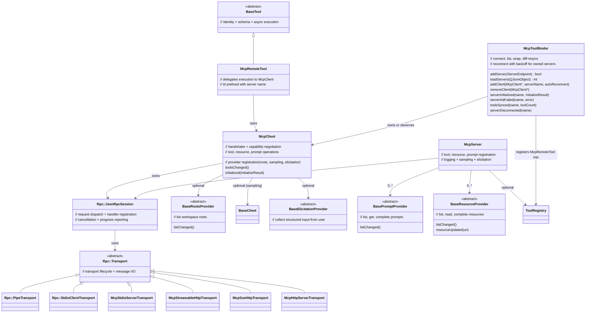

# MCP class diagram

```mermaid
classDiagram
    class RpcTransport["Rpc::Transport"] {
        <<abstract>>
        // transport lifecycle + message I/O
    }

    class RpcPipeTransport["Rpc::PipeTransport"]
    class RpcStdioClientTransport["Rpc::StdioClientTransport"]
    class McpStdioServerTransport
    class McpStreamableHttpTransport
    class McpSseHttpTransport
    class McpHttpServerTransport

    RpcTransport <|-- RpcPipeTransport
    RpcTransport <|-- RpcStdioClientTransport
    RpcTransport <|-- McpStdioServerTransport
    RpcTransport <|-- McpStreamableHttpTransport
    RpcTransport <|-- McpSseHttpTransport
    RpcTransport <|-- McpHttpServerTransport

    class JsonRpcSession["Rpc::JsonRpcSession"] {
        // request dispatch + handler registration
        // cancellation + progress reporting
    }

    JsonRpcSession --> RpcTransport : uses

    class McpClient {
        // handshake + capability negotiation
        // tool, resource, prompt operations
        // provider registration (roots, sampling, elicitation)
        toolsChanged()
        initialized(InitializeResult)
    }

    class McpServer {
        // tool, resource, prompt registration
        // logging + sampling + elicitation
    }

    McpClient --> JsonRpcSession : owns
    McpServer --> JsonRpcSession : owns
    McpClient --> BaseRootsProvider : optional
    McpClient --> BaseClient : optional (sampling)
    McpClient --> BaseElicitationProvider : optional
    McpServer --> BasePromptProvider : 0..*
    McpServer --> BaseResourceProvider : 0..*
    McpServer --> ToolRegistry : optional

    class BaseTool {
        <<abstract>>
        // identity + schema + async execution
    }

    class McpRemoteTool {
        // delegates execution to McpClient
        // id prefixed with server name
    }

    BaseTool <|-- McpRemoteTool
    McpRemoteTool --> McpClient : uses

    class McpToolBinder {
        // connect, list, wrap, diff-resync
        // reconnect with backoff for owned servers
        addServer(ServerEndpoint) bool
        loadServers(QJsonObject) int
        addClient(McpClient*, serverName, autoReconnect)
        removeClient(McpClient*)
        serverInitialized(name, InitializeResult)
        serverInitFailed(name, error)
        toolsSynced(name, toolCount)
        serverDisconnected(name)
    }

    McpToolBinder --> McpClient : owns or observes
    McpToolBinder --> ToolRegistry : registers McpRemoteTool into

    class BasePromptProvider {
        <<abstract>>
        // list, get, complete prompts
        listChanged()
    }

    class BaseResourceProvider {
        <<abstract>>
        // list, read, complete resources
        listChanged()
        resourceUpdated(uri)
    }

    class BaseRootsProvider {
        <<abstract>>
        // list workspace roots
        listChanged()
    }

    class BaseElicitationProvider {
        <<abstract>>
        // collect structured input from user
    }
```

## Two HTTP client transports, one choice point

`McpStreamableHttpTransport` speaks `2025-03-26` (POST, `Mcp-Session-Id` echoed from the first response, and once `initialize` returns a `GET` stream for the requests the server starts on its own). `McpSseHttpTransport` speaks `2024-11-05` (a long-lived `GET` SSE stream that announces a POST endpoint, with sends queued until it arrives). They share the `Rpc::Transport` seam and nothing else -- the state each keeps is meaningless to the other, which is why holding both in one object meant a reader could not tell which half of the fields were live.

`Mcp::makeHttpTransport()` is the only place that reads `HttpTransportConfig::spec`; `Mcp::makeTransport()` builds that config from a `ServerEndpoint` and hands it over, and each transport's `config().spec` reports its own revision whatever it was given. Everything downstream -- `McpClient`, `McpToolBinder`, the bridge -- sees an `Rpc::Transport` and cannot tell the revisions apart. That is what lets a decorator be applied to one revision and not the other without a second switch appearing somewhere else.

Timeouts travel on each request, not on the `HttpTransport`. POSTs carry `HttpTransportConfig::requestTimeoutMs`; both `GET` streams -- the 2024-11-05 session stream and the 2025-03-26 listen stream -- carry `sseIdleTimeoutMs` (five minutes by default), because they are quiet by design and the request timeout would cut them every two minutes. A transport the caller injects keeps its own timeout -- only the private `HttpClient` a transport creates for itself is set to `requestTimeoutMs`.

The 2025-03-26 listen stream holds one HTTP connection for as long as the session lives. Qt runs at most six HTTP/1.1 requests in parallel per host and port, so over plain `http://` -- where Qt does not negotiate HTTP/2 -- and on Qt 5.15, where HTTP/2 is off by default, five are left for POSTs. A sixth concurrent POST waits until one of them finishes. That only bites when five calls each hold their stream open waiting on the client, for instance on elicitation answers. Over `https://` with Qt 6 and a server that speaks HTTP/2, all requests share one connection and the limit does not apply.

A session the client is done with is ended with an HTTP `DELETE`: on `stop()`, when a new `initialize` supersedes it, and from the destructor. The request is fire-and-forget with a short timeout, so it never delays shutdown. From the destructor it only reaches the server through an injected `HttpTransport`; the private `HttpClient` is a child of the transport and aborts the request as it is destroyed. Keeping that client alive just to say goodbye is not worth it -- the spec makes the `DELETE` a SHOULD and the server reaps idle sessions anyway. A session the server ended with a 404 is not deleted.

A request whose POST stream ends before the answer is not lost when the server gave that stream an event id: the exchange stays open and continues on a `GET` with `Last-Event-ID`, the way the 2025-11-25 spec lets a server close a stream and have the client poll. Each exchange keeps its own cursor, `retry` and backoff, separate from the listen stream's.

A request the session stops waiting for -- cancelled by the caller or timed out -- is abandoned: `JsonRpcSession` calls `Rpc::Transport::abandon(requestId)`, and `McpStreamableHttpTransport` aborts that request's POST stream so it stops holding a connection. An abandoned request never produces `sendFailed`, and an answer that arrives on another stream afterwards is dropped by the session as an unknown id. The base implementation does nothing, which is right for transports whose replies do not occupy a per-request resource: stdio, pipes and the 2024-11-05 transport, where answers come over the shared `GET` stream.

## What ships with each seam

An abstract class with no implementation is a shape nobody has confirmed. Three of the four provider seams now ship one, so the seam is answered by code rather than by a promise:

- **`BaseElicitationProvider`** → `CallbackElicitationProvider`. One virtual method, so the adapter is a `std::function` -- the same shape as `Acp::CallbackPermissionProvider`, which is the one provider seam in the tree that gets used. The interface stays: a Qt Creator plugin or a mobile host may want a real class with state, and elicitation is where a host puts its own dialog.
- **`BaseRootsProvider`** → `DirectoryRootsProvider`. A set of absolute directories turned into percent-encoded `file://` roots, emitting `listChanged` when the set actually moves; an empty or relative path is refused with a warning rather than quietly becoming the working directory. Six virtual methods would have been a callback; one method plus a signal is a small object, and every host that has roots at all has them as directories.
- **`BaseResourceProvider`** → `StaticResourceProvider`. An in-memory URI → contents map. Only two of its six virtuals are pure; a static provider fills those and inherits the rest, which is the cheapest possible proof that the optional half of the seam is optional in practice. Taking no subscriptions, it never sends `resourceUpdated`; it announces `listChanged` only when an entry of `resources/list` appears, disappears or changes its description.
- **`BasePromptProvider`** → nothing, deliberately. A prompt's value is `getPrompt(name, arguments)` rendering a template against those arguments; a static list that ignores the arguments would confirm nothing about the seam and would tempt hosts into shipping prompts that silently drop their inputs. The seam stays abstract until a real templating provider exists to shape it.

None of these are wired into `mcp-bridge`: what the bridge exposes is a product decision, not a consequence of a class existing.

## Ownership rules

- **`Rpc::JsonRpcSession`** — owned by `McpClient` or `McpServer`. Never outlives owner.
- **`Rpc::Transport`** — passed via constructor, NOT reparented. Caller owns lifetime.
- **`McpRemoteTool`** — parented to `ToolRegistry` (via `addTool`). Dies with registry or on `McpToolBinder` resync. Its id is `<server>_<tool>` when the binder knows the server name, so two servers exposing the same tool never collide.
- **Providers** (`BasePromptProvider`, `BaseResourceProvider`, `BaseRootsProvider`, `BaseElicitationProvider`) and sampling `BaseClient` — held as `QPointer`. Caller owns, must outlive server/client, and must keep them on the server's or client's thread: they are called from it and emit their signals on it, and installing one that lives elsewhere trips an assertion in Debug builds. The shipped implementations are ordinary `QObject`s and follow the same rule.
- **Ready answers** — a provider that already knows its answer returns `readyFuture(...)` from `FutureUtils.hpp`. No provider in the tree builds a `QPromise` by hand; the ones that still hold promises (`TerminalManager`'s exit waiters, the session request tables) are genuinely deferred, which is a different thing.
